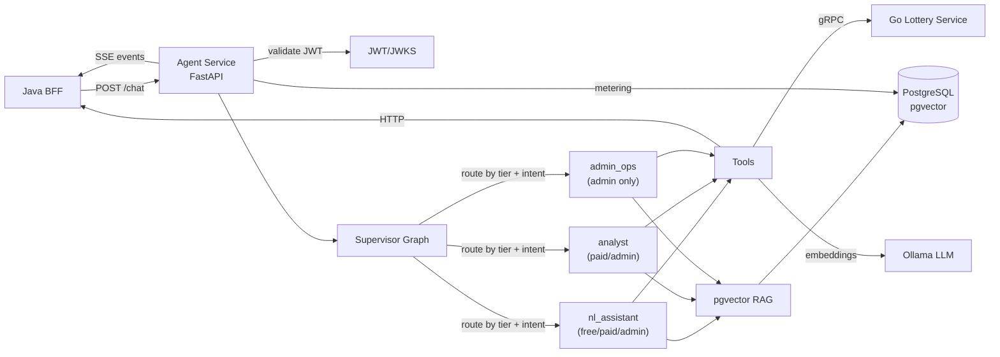

# Statistiloto Agent

> Python LangGraph agent worker — hierarchical multi-agent orchestration with RAG, HITL, token metering, and gRPC to the Go lottery service.

## Tech Stack

- **Python 3.11–3.13** (3.12 recommended)
- **FastAPI** — HTTP API server (uvicorn)
- **LangGraph** — hierarchical multi-agent graph orchestration with AsyncPostgresSaver checkpointer
- **LangChain** — LLM abstraction (Ollama + Google Gemini providers)
- **pgvector** — vector similarity search for RAG (PostgreSQL extension)
- **gRPC** — generated stubs from `proto/lottery.proto` for the Go lottery service
- **Pydantic / pydantic-settings** — request/response models, config validation
- **structlog** — structured logging
- **SSE (sse-starlette)** — server-sent events for streaming chat responses
- **Redis** — optional Redis Streams backend for `/chat/stream` (replayable; falls back to inline SSE when unavailable)

## Architecture



The **supervisor graph** is the single choke point for tier gating. It routes by `tier` + `intent` to one of three worker subgraphs. Disallowed intents are downgraded to `nl_assistant`. It also detects multi-operation messages (`_detect_multiple_requests()`) and asks the user to pick one, with a generate-then-save exemption. Deterministic domain explanations (incl. `lucky_numbers` and `saved_numbers`) come from `app/domain_registry.py`.

## Tier Capabilities

| Capability | Free | Paid | Admin (owner) |
|---|---|---|---|
| Workers | `nl_assistant` only | `nl_assistant`, `analyst` | all three |
| RAG corpora | `docs` | `docs`, `lottery_history` | `docs`, `lottery_history`, `user_data` (all users), `ops_logs` |
| Write tools | none | `save_numbers` | `save_numbers`, `trigger_scraper`, `edit_file` |
| Read tools | `generate_form`, `get_statistics`, `analyze` | + `list_saved_numbers` | + `query_audit_log`, `read_token_usage`, `search_web`, `read_code`, `list_files` |
| HITL | never (no write tools) | on `save_numbers` | on `save_numbers`, `trigger_scraper`, `edit_file` |
| Daily budget | $0 (no limit) | $5.00 | $0 (no limit — owner) |
| Recursion limit | 6 | 25 | 50 |
| Saved sessions | 1 | 15 | unlimited |

> **Admin** is the owner/developer super-user — NOT a paid tier. Admin has no budget limit and sees all users' data (the `user_data` RAG filter is bypassed for admin).

## API Endpoints

| Method | Path | Auth | Description |
|---|---|---|---|
| `POST` | `/chat` | any authenticated user | Process a chat message. Returns `{response, thread_id}` or `{paused: true, thread_id}` for HITL. |
| `POST` | `/chat/stream` | any authenticated user | Stream chat events. `Accept: application/json` → `{thread_id, channel}` for Redis Streams replay; `Accept: text/event-stream` → inline SSE. Emits `progress`, `token`, `heartbeat`, `paused`, `done`, `error` events; exactly one terminal event per run. |
| `POST` | `/approve` | any authenticated user | Resume a paused HITL thread with a human decision (`approved: bool`, optional `edited` value). |
| `POST` | `/approve/stream` | any authenticated user | Same as `/approve` but streams the resumed run over the same event contract as `/chat/stream`. |
| `GET` | `/healthz` | none | Health check — returns `{"status": "ok"}`. |
| `GET` | `/sessions` | any authenticated user | List the caller's chat sessions (newest first) with the tier's session limit. |
| `GET` | `/sessions/{session_id}` | any authenticated user | Load a session's full message history from the checkpointer. |
| `DELETE` | `/sessions/{session_id}` | any authenticated user | Delete one chat session and its checkpointer state. |
| `DELETE` | `/sessions` | any authenticated user | Delete all of the caller's chat sessions. |
| `POST` | `/sessions/archive` | any authenticated user | Soft-archive all of the caller's chat sessions (sets `archived_at`, deletes checkpointer state). Used on account deletion. |
| `GET` | `/sessions/archived` | admin only | List archived chat sessions across all users (newest archived first). |
| `GET` | `/llm-config` | any authenticated user | Read the current global LLM config (provider, model, base_url, etc.). |
| `PUT` | `/llm-config` | admin only | Update the global LLM config. Hot-reloaded within ~10s via poller (or immediately via `force_refresh()`). |
| `GET` | `/llm-configs` | admin only | List all stored LLM configurations. |
| `POST` | `/llm-configs` | admin only | Create a new stored LLM configuration. |
| `PUT` | `/llm-configs/{config_id}/activate` | admin only | Activate a stored LLM configuration by id. |
| `POST` | `/llm-configs/{config_id}/test` | admin only | Smoke-test a stored LLM configuration. |
| `DELETE` | `/llm-configs/{config_id}` | admin only | Delete a stored LLM configuration. |
| `GET` | `/llm-models?provider=...` | admin only | List models available from a given provider (Ollama queried live via `/api/tags`; Gemini/OpenAI/Anthropic return static lists). |
| `GET` | `/token-usage` | admin only | Read aggregated token usage stats from `agent.token_usage`. |
| `GET` | `/audit-log?limit=50` | admin only | Read recent audit log entries from the DB (optional `limit`, default 50). |
| `POST` | `/reindex` | admin only | Rebuild the `docs` RAG corpus: ingest markdown from `app/rag/docs_source/` into `agent.embeddings` (content-hash dedup). |

## Tool Classification

Tools are classified in `app/tools/registry.py` as `WRITE_TOOLS` and `READ_TOOLS` frozensets. HITL approval is required before executing ANY write tool — this is automatic and not configurable per tier.

### Write Tools (require HITL)

| Tool | Backend | Description |
|---|---|---|
| `save_numbers` | Java BFF (POST) | Writes saved numbers to DB |
| `trigger_scraper` | Go service | Triggers Go scraper, writes lottery draw data |
| `edit_file` | local FS (admin only) | Edits a file in the agent's own source tree |

### Read Tools (no HITL)

| Tool | Backend | Description |
|---|---|---|
| `generate_form` | Go gRPC | Computes lottery forms |
| `get_statistics` | Go gRPC | Reads statistics |
| `analyze` | Go gRPC | Reads historical matches |
| `list_saved_numbers` | Java BFF (GET) | Reads saved numbers |
| `query_audit_log` | DB SELECT | Reads audit log |
| `read_token_usage` | DB SELECT | Reads token stats |
| `search_web` | DuckDuckGo (admin only) | Public web search |
| `read_code` | local FS (admin only) | Reads a file from the agent's source tree |
| `list_files` | local FS (admin only) | Lists files under a directory |
| `list_db_tables` | DB (admin only) | Lists tables and columns in a schema |
| `query_db` | DB (admin only) | Runs a read-only SQL SELECT |

## Project Structure

```
agent/
├── AGENTS.md                  # Architecture reference for AI agents
├── Dockerfile                 # Multi-stage build (Python 3.12-slim)
├── Makefile                   # install, proto, dev, test targets
├── docker-compose-dev.yml     # Ollama + pgvector DB + agent
├── pyproject.toml             # Dependencies + pytest config
├── proto/                     # Shared protobuf (symlinked from ../proto)
├── db/
│   └── init-agent.sql         # DB schema init (agent schema, pgvector, chat_sessions.archived_at)
├── app/
│   ├── main.py                # FastAPI app — endpoints, graph singleton
│   ├── security.py            # JWT validation (JWKS), tier extraction, admin guard
│   ├── metering.py            # Token metering decorator + daily budget check
│   ├── checkpointer.py        # AsyncPostgresSaver checkpointer management
│   ├── prompt_builder.py      # Shared LLM prompt constants + builders (domain knowledge, language rules)
│   ├── sessions.py            # Chat session history (list/load/delete/archive) + tier retention limits
│   ├── redis_client.py        # Optional Redis Streams client for /chat/stream events
│   ├── renderer.py            # Zero-LLM deterministic response renderer
│   ├── normalizer.py          # Request normalization + language detection (inherits language from prior turn for language-neutral messages)
│   ├── domain_registry.py     # Canonical domain definitions (incl. lucky_numbers, saved_numbers)
│   ├── config/
│   │   ├── settings.py        # YAML + env config, tier configs
│   │   └── agent.yaml         # Default config values
│   ├── graphs/
│   │   ├── supervisor.py      # Top-level router (tier + intent gating, accepts UI context)
│   │   ├── nl_assistant.py    # NL lottery assistant subgraph
│   │   ├── analyst.py         # Multi-step analysis subgraph (RAG + tools)
│   │   └── admin_ops.py       # Admin operations subgraph (HITL on writes)
│   ├── tools/
│   │   ├── registry.py        # WRITE_TOOLS / READ_TOOLS classification
│   │   ├── lottery_grpc.py    # Go gRPC tool clients (generate_form, etc.)
│   │   ├── saved_numbers.py   # Java BFF saved numbers tools
│   │   └── admin_ops.py       # Audit log + token usage read tools
│   ├── rag/
│   │   ├── store.py           # psycopg3 connection pool (singleton)
│   │   ├── retriever.py       # Role-scoped, per-tenant pgvector retrieval
│   │   ├── indexers.py        # Document indexing into pgvector
│   │   ├── ingest.py          # Docs ingestion (markdown → embeddings, content-hash dedup)
│   │   ├── admin_commands.yaml # Keyword → admin tool mappings for admin_ops
│   │   └── docs_source/       # Product docs (.md) indexed into the 'docs' corpus
│   ├── llm/
│   │   ├── config_store.py    # Global LLM config store + hot-reload poller
│   │   └── router.py          # LLM provider routing (Ollama / Gemini / mock)
│   └── gen/                   # Generated gRPC stubs (from make proto)
│       ├── lottery_pb2.py
│       └── lottery_pb2_grpc.py
└── tests/
    ├── unit/                  # Unit tests (no DB, no external services)
    │   ├── test_config.py
    │   ├── test_normalizer_language.py
    │   ├── test_security.py
    │   └── test_supervisor.py
    ├── integration/           # Integration tests (real pgvector DB, mock LLM)
    │   ├── conftest.py        # Mock LLM, embeddings, tool clients, test JWT
    │   ├── test_chat_stream.py # SSE/stream contract: progress, token, paused, done, error
    │   ├── test_chat_flows.py # Real-LLM flows (e2e_llm marker, needs Ollama)
    │   └── ...                # free/paid/admin, sessions, metering, RAG, stream replay
    ├── integration_real_llm/  # Real-LLM integration tests (needs Ollama running)
    └── eval/                  # Deterministic routing/normalizer evaluation suite
```

## Quick Start

### Prerequisites

- Python 3.12+ (use [`uv`](https://github.com/astral-sh/uv) for venv management)
- Docker + Docker Compose (for pgvector DB + Ollama)

### Setup

```bash
make install          # create venv + install deps
make proto            # generate gRPC stubs from shared proto
```

### Run Dev Stack

```bash
make dev              # docker-compose-dev.yml: pgvector DB + Ollama + agent
# Agent at http://localhost:8000
```

To stop the dev stack:

```bash
make dev-stop
```

## Environment Configuration

Settings are loaded from `app/config/agent.yaml` with environment variable overrides applied on top (see `app/config/settings.py`).

| Variable | Default | Description |
|---|---|---|
| `LLM_PROVIDER` | `ollama` | LLM provider: `ollama` \| `gemini` \| `mock` |
| `LLM_MOCK` | `false` | Set to `true` to use `FakeListChatModel` for tests |
| `OLLAMA_BASE_URL` | `http://ollama:11434` | Ollama API URL |
| `OLLAMA_MODEL` | `dicta-instruct-1.7b` | Ollama model name (Hebrew-native DictaLM instruct — small + fast on CPU) |
| `OLLAMA_MODELS` | _(list in agent.yaml)_ | Comma-separated trusted local models — missing ones are pulled on startup |
| `GEMINI_API_KEY` | _(empty)_ | Google Gemini API key |
| `GEMINI_MODEL` | `gemini-2.0-flash` | Gemini model name |
| `DB_URI` | `postgresql://postgres:postgres@db:5432/statistiloto` | PostgreSQL connection string |
| `JWT_VERIFY` | `true` | Set to `false` to skip JWT signature verification (dev/test) |
| `JWKS_URL` | _(empty)_ | Keycloak JWKS URL for JWT verification |
| `ISSUER` | _(empty)_ | Expected JWT issuer |
| `AUDIENCE` | _(empty)_ | Expected JWT audience |
| `LOTTERY_GRPC_HOST` | `lottery` | Go lottery service host (empty = tools return empty) |
| `LOTTERY_GRPC_PORT` | `9090` | Go lottery service gRPC port |
| `BFF_BASE_URL` | `http://server:8082` | Java BFF base URL (empty = saved_numbers tools return empty) |
| `REDIS_URL` | _(empty)_ | Optional Redis URL (e.g. `redis://localhost:6379`). Enables Redis Streams relay for `/chat/stream`; if unset, falls back to inline SSE. |
| `ALLOWED_ISSUERS` | _(empty)_ | Comma-separated list of trusted JWT `iss` values. When set, tokens from other issuers are rejected (signature + audience are always verified). |
| `LLM_REQUEST_TIMEOUT_SECONDS` | `300` | LLM request timeout in seconds |
| `AGENT_LOG_LEVEL` | `INFO` | Logging level |

## Testing

Integration tests use a real pgvector PostgreSQL (from `docker-compose-dev.yml`) with a mock LLM (`FakeListChatModel`), mock embeddings, and mock tool clients. The DB must be running.

```bash
# Start the DB first
docker compose -f docker-compose-dev.yml up -d db

make test             # all tests (unit + integration)
make test-unit        # unit tests only (no DB needed)
make test-integration # integration tests only (needs DB)
```

### Test Conventions

- **Unit tests** (`tests/unit/`) — no DB, no external services
- **Integration tests** (`tests/integration/`) — real pgvector DB, mock LLM + mock tools
- Mock LLM is injected via `set_llm_store()` in `conftest.py`
- Mock embeddings injected via `set_embeddings_model()` in `conftest.py`
- Mock tool clients (lottery gRPC + saved_numbers) injected via `set_mock_client()` in `conftest.py`
- JWT tokens created via `create_test_jwt(sub=..., tier=...)` in `app/security.py`

## Docker

### Dev (docker-compose-dev.yml)

Brings up three services:

| Service | Image | Port | Description |
|---|---|---|---|
| `ollama` | `ollama/ollama:latest` | `11434` | Local LLM inference (CPU-only dev) |
| `db` | `pgvector/pgvector:pg16` | `5433` | PostgreSQL with pgvector extension |
| `agent` | built from `Dockerfile` | `8000` | Agent service (hot-reload via volume mount) |

```bash
make dev      # up -d
make dev-stop # down
```

### Production Dockerfile

Multi-stage build on `python:3.12-slim`:

1. **Builder stage** — installs dependencies via `uv pip install --system`
2. **Runtime stage** — copies site-packages + `app/` directory, exposes port 8000, healthcheck on `/healthz`

```bash
docker build -t statistiloto-agent .
docker run -p 8000:8000 statistiloto-agent
```

## Documentation

- [AGENTS.md](AGENTS.md) — Architecture reference for AI coding agents
- [docs/REQUIREMENTS.md](docs/REQUIREMENTS.md) — Functional and non-functional requirements
- [docs/FLOWS.md](docs/FLOWS.md) — Mermaid sequence/flow diagrams for key operations
