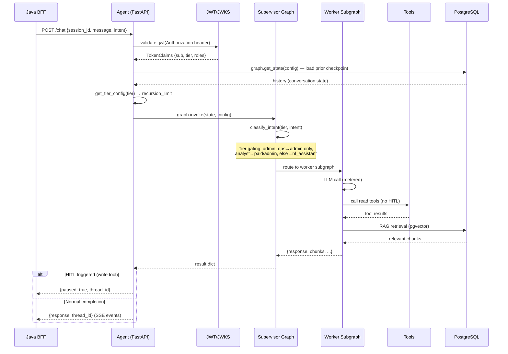
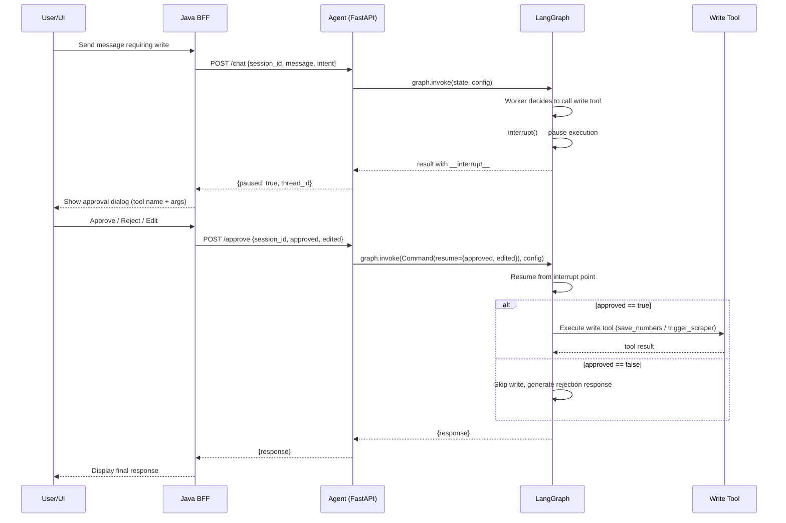
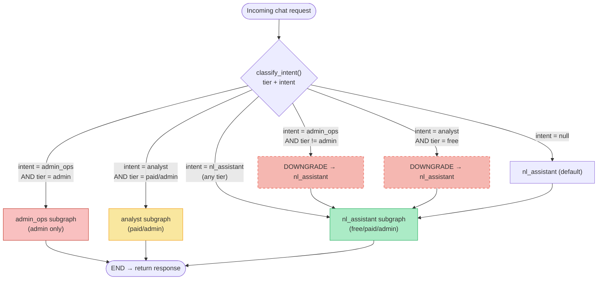
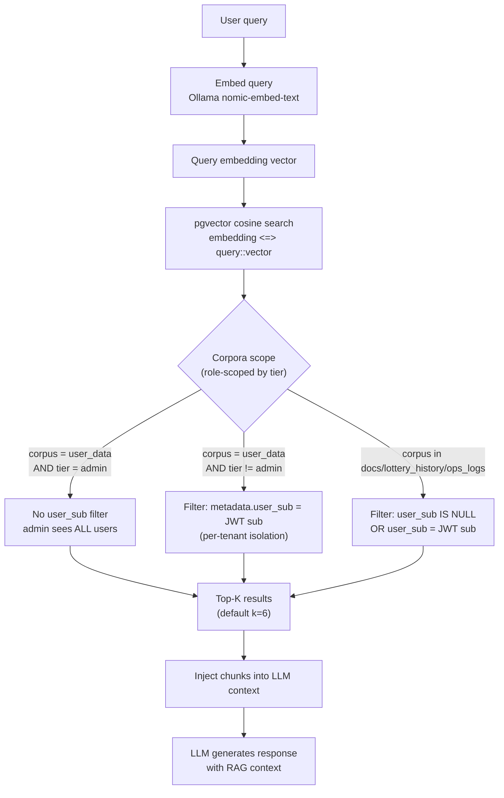
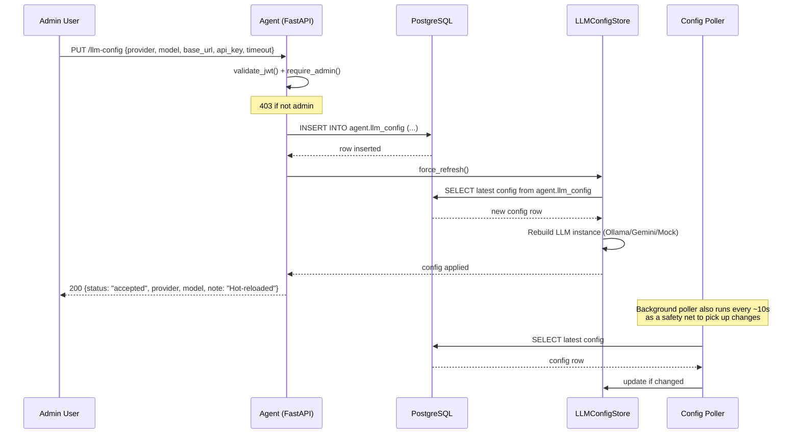

# Flows — Statistiloto Agent

Mermaid diagrams for the key operational flows in the agent service.

## Chat Request Flow

## Human-in-the-Loop (HITL) Flow

## Supervisor Routing Flow

**Routing rules** (from `app/graphs/supervisor.py`):

| Intent | Free | Paid | Admin |
|---|---|---|---|
| `nl_assistant` | ✅ | ✅ | ✅ |
| `analyst` | ❌ → `nl_assistant` | ✅ | ✅ |
| `admin_ops` | ❌ → `nl_assistant` | ❌ → `nl_assistant` | ✅ |
| `null` | `nl_assistant` | `nl_assistant` | `nl_assistant` |

## RAG Retrieval Flow

**Key security property**: `user_data` is ALWAYS filtered by `user_sub` from the JWT for non-admin users — never trusted to the LLM to self-scope. Admin bypasses this filter to see all users' data for support/debugging.

## LLM Config Update Flow

**Hot-reload mechanism**: The `PUT /llm-config` endpoint writes to `agent.llm_config` and calls `force_refresh()` for immediate effect. A background poller (started on app startup, every ~10s) acts as a safety net to pick up any changes — no restart needed.
